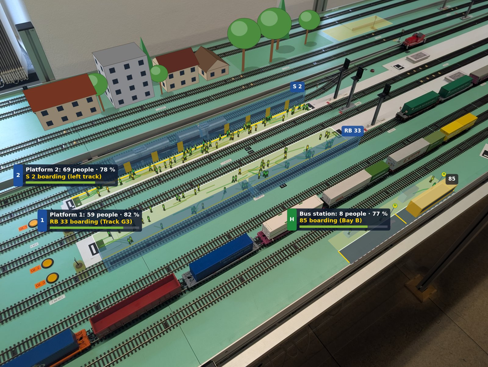
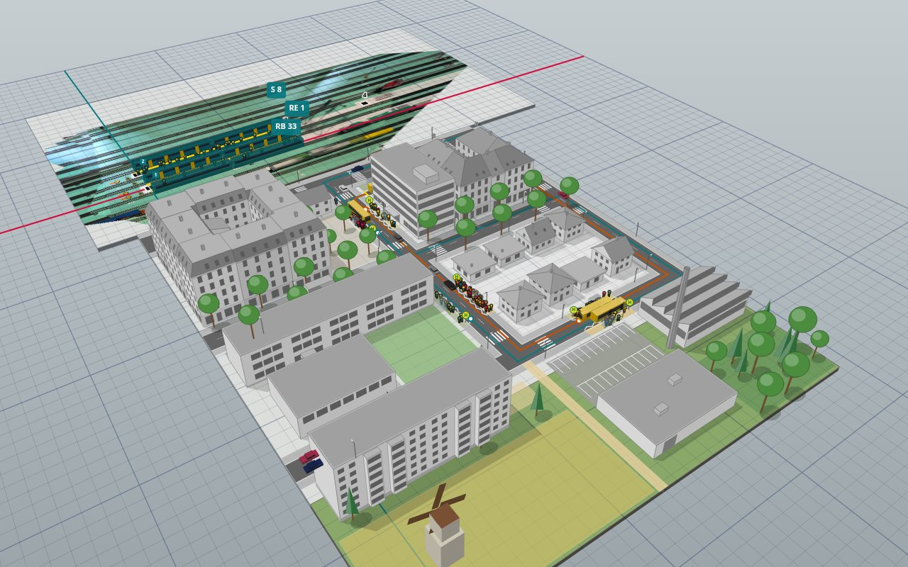

# ARail-EBL

**Augmented reality for model railway laboratories.** Point a phone, tablet or webcam at a model railway layout: ARail puts platforms full of passengers, a small town with streets and bus lines and a container terminal on it, runs the town through day and night, runs a railway undertaking with its fleet, workshop and crews, lets students manage the railway's infrastructure as a game, simulates disruptions, and shows the trains your control system reports. A flyover lets you look at and build the layout with a virtual camera. It runs in the browser, needs no installation and no calibration board.

[**Open the app**](https://joernmht.github.io/ARail-EBL/app/) · [Project page](https://joernmht.github.io/ARail-EBL/) · [Print markers](https://joernmht.github.io/ARail-EBL/markers/) · [Sign for the layout](https://joernmht.github.io/ARail-EBL/notice/) · [Documentation](docs/README.md)



*A photo of the railway operations lab (EBL) layout, augmented by ARail: the virtual objects are registered on the real H0 table from the printed markers alone. At the front right, a virtual table module with a street extends the table.*

ARail-EBL started as a prototype for the railway operations laboratory (EBL) and is meant for other railway labs, model railway clubs and teaching as well. The passenger and town simulations are examples; the framework is built so that you can add your own objects, simulations and disruption types.

## What it does

| | |
| --- | --- |
| **Platforms with passengers** | A platform between two markers. Passengers arrive, wait at the edge where their train stops, board and alight through the doors; their colour shows their mood. |
| **A town, day and night** | German house types in the greys of an architectural model: Plattenbau (WBS 70, QP 61, P2), Gründerzeit blocks, single-family houses and estates, school, supermarket, office, workshop, a modern station building with a pedestrian underpass; trees, forests, fields, water, labels. A fast clock (1:12) drives the lighting, the timetables and the residents, who go to work, school and shopping on foot, by bus and by train; at night windows and street lamps light up. |
| **Streets and buses** | Streets form a road network with sidewalks, crossings and street lamps. Bus stops, bus terminals and bus lines with several stops, back and forth or as a ring (*Ring ↻*, *Ring ↺*); road traffic. |
| **Flyover and table modules** | A virtual camera (key `F`) to look at and edit the layout without the camera image: a snapping grid, the orthophoto of the real table, and virtual table modules that extend the tabletop. |
| **Container terminal** | Container trains, trucks and barges at a terminal with a gantry crane, a reach stacker and yard blocks. Choose a container and its new place in the Terminal panel or on the stage; the crane does the move. Model wagons on the real layout carry printed deck cards with AprilTag tags (a marker family of their own), so their containers ride on them. |
| **Rail operations** | Units with maintenance cycles and failures that grow with age and wear, a depot workshop, and the four functions of the entity in charge of maintenance (ECM), each with a party of its own; penalties between the transport authority, the railway undertaking, the ECM and the workshop. Drivers with contracts, duties under the working-time rules and a roster, who live in the town and walk to the depot, or come in by train. Compare setups (integrated or distributed maintenance, crew buffers) under stress tests: a flu wave, a staff shortage, a heat wave. |
| **Infrastructure** | The station on the layout as part of an invented district with two lines: track, switches, signals, balises, interlockings, level crossings, cables, GSM-R, overhead lines, platforms, lifts and displays, each with its condition (grades 1–6), faults and an age. How well a condition is known depends on the asset: a digital interlocking reports it live, a relay interlocking only shows faults, old signals must be inspected. Maintenance staff in shifts, emergency vans that drive through the town, drones; renewals and upgrades through the HOAI phases with federal funding (benefit-cost ratio), planning approval, tenders and a level crossing plant. Students play the asset manager, the ALVs, the dispatcher, the planner, the construction supervision and the funding authority, year by year with limited money and people. Assets are coloured on the photo by their condition and last check; a line map and GeoJSON for GIS. |
| **Lab survey** | Stickers all over the table, one video: `arail-survey` measures every marker and writes a fixed, locked layout, a report and an orthophoto of the table; in the app, *Build → Marker map → Survey a video* gives a quick check. Markers on vehicles can be set as moving; they stay out of the map. |
| **Disruptions and scenarios** | Delays, cancellations, closures, signal failures, crowd surges, rail replacement buses; scripted scenarios for exercises. |
| **Control-system interface** | A Python bridge forwards real train positions over WebSocket. When a real train stops at a platform, the virtual passengers board it. |
| **Extensible** | Plugins (plain ES modules) add object types, simulations, disruption types and vehicles. Settings forms are generated automatically. |



*The example layout in the flyover: a town on eight virtual table modules in front of the real lab table, which shows its orthophoto.*

Under the hood: square markers ([ArUco or AprilTag](docs/lab-setup.md#markers)) lie flat on the layout. From the images alone, ARail surveys where the markers are, computes the camera pose from all visible markers and estimates the camera's focal length. On the lab photo at the top, the estimated focal length (1110 px) agrees with the value derived from the photo's metadata (1111 px), and the platforms come out at 700.7 mm and 718.4 mm, in line with the prototype's earlier measurement of about 700 and 720 mm.

## Quick start

**Try it:** open the [app](https://joernmht.github.io/ARail-EBL/app/). It starts with a photo of the lab layout. Use the tabs on the right to add objects (Build), change the simulation and the time of day (Simulate), move containers (Terminal), start disruptions and scenarios (Disruptions) and connect a control system (Control). Press **F** (or **Flyover**) to fly over the layout and the example town with a virtual camera, and **Simulate → Night 22:30** to see it at night. **Layouts… → Example: container terminal** opens the terminal in the flyover, and the layers of the lab example (**View → Layers**) add its fleet, depot and drivers (**Rail operations**, Operations tab) or make it a station of an infrastructure district (**Infrastructure**, Infrastructure tab).

**On your own layout:**

1. Print markers from the [marker sheet page](https://joernmht.github.io/ARail-EBL/markers/) (ArUco Original, 30 mm) and check the scale with a ruler.
2. Put one marker at each end of every platform and more across the layout, flat and with their white border visible.
3. Open the app, choose **Layouts… → Example: synthetic layout** as a starting point or import your own layout, then **Take photo** or **Live camera**. The markers are surveyed automatically.
4. In **Build**, add platforms (tap the two markers at its ends), streets, bus stops and lines, buildings and scenery, in the camera view or in the flyover on the grid. **Export layout** saves the result as a JSON file.

For a fixed layout of a whole table, follow the [lab-session guide](docs/lab-session.md): stickers all over the table, one video, `arail-survey`, then build in the flyover. See [Getting started](docs/getting-started.md) and [Setting up a lab](docs/lab-setup.md) for details. The live camera needs https (GitHub Pages) or `localhost`.

**Connect a control system:** `pip install -e "tools[bridge]"` and run the bridge with the built-in simulator, then press **Connect** in the app's Control panel:

```bash
arail-bridge --adapter simulator --layout web/layouts/ebl-lab.json
```

Write an adapter for your system from the template; see [Control-system interface](docs/control-system-interface.md).

## Documentation

| Guide | For |
| --- | --- |
| [Getting started](docs/getting-started.md) | Using the app: sources, the flyover, panels, keyboard shortcuts |
| [Setting up a lab](docs/lab-setup.md) | Markers (also on model wagons), printing, placement, cameras, the marker map |
| [Lab session](docs/lab-session.md) | Stickers on the whole layout, one video, `arail-survey`: a fixed layout and an orthophoto |
| [Day and night](docs/day-and-night.md) | The fast clock, lighting, demand over the day, the town simulation |
| [Streets, bus lines and road traffic](docs/streets-and-buses.md) | The road network, bus stops, bus lines, cars |
| [Container terminal](docs/container-terminal.md) | Trains, trucks, barges, cranes and the yard; deck cards and rolling-stock markers for model wagons |
| [Rail operations](docs/operations.md) | Fleet, maintenance (ECM) and penalties, crews and rosters; comparing setups under stress tests |
| [Infrastructure](docs/infrastructure.md) | Assets with their condition and what is known of it, maintenance staff, emergency vans and drones, renewals through the HOAI phases with funding and tenders; roles for students; the asset information model and GIS |
| [Layout file format](docs/layout-format.md) | The JSON file that describes a layout and all built-in object types |
| [Disruptions and scenarios](docs/disruptions-and-scenarios.md) | Built-in disruptions, their effects, scripting scenarios |
| [Control-system interface](docs/control-system-interface.md) | Feed protocol, bridge, adapters, https/wss |
| [Extending ARail](docs/extending.md) | Plugins: object types, simulations, disruptions, vehicles |
| [Architecture](docs/architecture.md) | How tracking, the world and rendering fit together; the maths |
| [Camera calibration](docs/calibration.md) | Optional calibration for wide-angle webcams |

## Repository layout

```
web/                  the website (published with GitHub Pages)
  index.html          project page
  app/                the AR app, with the flyover and the in-app video survey
  markers/            printable marker sheets and deck cards for model wagons
  arail/              the framework (ES modules, no build step)
    core/             tracking, geometry, world, rendering, clock, road network, bus lines,
                      flyover camera, services, disruptions, scenarios
    objects/          built-in object types (platform, houses, streets, bus stops and lines,
                      table modules, trees, ...)
    sims/             simulations: passengers, town (day and night), road traffic
    terminal/         the container terminal: containers and carriers, yard, cranes, trains, trucks,
                      barges, model wagons from rolling-stock markers
    ops/              rail operations: timetable and rotations, units and failures, maintenance (ECM),
                      contracts and penalties, crews and dispatching, comparisons, the depot
    infra/            infrastructure: asset types and their condition, the network (km, georeference,
                      GeoJSON), staff in shifts, faults and inspections, projects (HOAI, funding,
                      procurement), the level crossing plant, the objects on the layout
    feeds/            control-system feeds: WebSocket client, simulated control system
  plugins/            example plugins (windmill object, road traffic simulation)
  layouts/            example layout files (the EBL lab, the synthetic layout, the container terminal,
                      the EBL lab with rail operations, the EBL lab as an infrastructure district)
  media/              the images of the example layouts (lab photo, synthetic layout) and their orthophotos
  assets/             logos, icons and the website's images
  vendor/js-aruco2/   marker detection library (MIT)
tools/                Python tools: control-system bridge, calibration, lab survey, synthetic test scenes;
                      ops-compare.mjs (comparing operations setups from the command line)
tests/                JavaScript (node:test), Python (pytest) and browser (Playwright) tests
docs/                 documentation
examples/             original photo and video of the lab, a recorded control-system feed
```

## Development

Requirements: Node.js 22+, Python 3.10+.

```bash
npm start                                   # serves web/ at http://localhost:8000
pip install -e "tools[headless,bridge,dev]" # Python tools (use [opencv] instead of [headless] on a desktop)
npm run fixtures                            # test images for the JavaScript tests (needs OpenCV)
npm test                                    # JavaScript unit and integration tests
python -m pytest tests/python               # Python tests
npx playwright install chromium && npm run test:e2e   # browser tests
```

See [CONTRIBUTING.md](CONTRIBUTING.md). The original German prototype ("Bahnsteig-AR", Python + browser) is in the git history (commit `ae73015`); its logic lives on in `web/arail`.

## Status

Version 0.1, with unreleased changes on `main` (see [CHANGELOG.md](CHANGELOG.md)): the town with its day and night routine, streets and bus lines, the flyover with table modules, the lab survey, the container terminal with rolling-stock markers, rail operations with fleet maintenance and crews, infrastructure asset management as a game for students, and the app in the chair's corporate design. Tested with a synthetic layout, a photo and a handheld video of the lab. Next: a lab session in the EBL (stickers on the whole table, one video, a fixed layout), live sessions with phones, webcams and a projector, and an adapter for the lab's control system. Known limits: markers smaller than about 20 px in the image are not found; the camera must always see at least one known marker; virtual objects are always drawn in front of real ones (no occlusion).

## License and credits

MIT, see [LICENSE](LICENSE). The app follows the corporate design of the Chair of Railway Operations (Professur für Bahnverkehr, öffentlicher Stadt- und Regionalverkehr), TU Dresden: Türkis, Noto Sans and the chair's logo. The logo is © TU Dresden and not covered by the MIT license. Marker detection builds on [js-aruco2](https://github.com/damianofalcioni/js-aruco2) (MIT) with dictionaries from OpenCV (BSD-3-Clause) and AprilTag (BSD-2-Clause); see [THIRD_PARTY_NOTICES.md](THIRD_PARTY_NOTICES.md). If you use ARail-EBL in research or teaching, please cite it ([CITATION.cff](CITATION.cff)).
