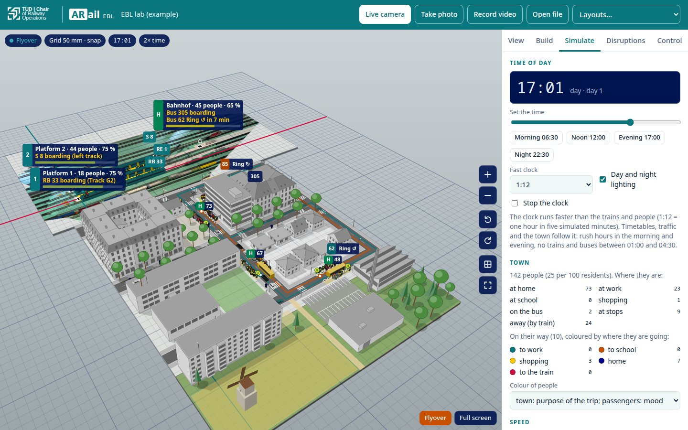

# Getting started

The app runs in any current browser (Chrome, Edge, Firefox, Safari) on phones, tablets and PCs. Open it at <https://joernmht.github.io/ARail-EBL/app/>, or locally with `npm start` (then <http://localhost:8000/app/>).

The live camera needs a secure page: https (GitHub Pages) or `localhost`. Photos and videos work everywhere.

## Image sources

The top bar chooses what the app looks at:

| Button | What it does |
| --- | --- |
| **Live camera** | Uses the rear camera (phones) or the default webcam. Keeps the screen awake. |
| **Take photo** | Opens the camera app of a phone; the photo is analysed once at high resolution. |
| **Record video** | Records a video with the phone's camera app and plays it in a loop. |
| **Open file** | A photo or video from the device. |
| **Layouts…** | Loads an example layout together with its example image. |

Photos are the easiest way to start: detection runs once at full resolution, and objects can be placed precisely. **Freeze** (bottom right of the stage) keeps the current video frame for editing. **Full screen** is useful with a projector.

**Flyover** (bottom right, or key F) replaces the camera image by a virtual camera that flies around the layout: the table, its photo from above (`view.ortho`, if the layout has one), a grid, the markers and everything virtual, by day and by night. Drag to turn the view, Shift-drag, right-drag or two fingers to pan, scroll or pinch to zoom; the buttons at the right zoom, rotate, switch to the plan view and show the whole layout. In Build, everything works as on the camera image, and placed or dragged objects snap to the grid (hold Alt for free placement); **Build → Table → Table module** extends the tabletop with virtual table modules: drag from one corner to the opposite one. Press F again to return to the camera image.

## What you see

The chips at the top left show the tracking state: *Tracking · 5 markers* means the layout is registered using five markers; *holding position* means all markers are hidden for a moment and the last pose is kept (1.5 s).

Each stop has a sign with its number, the number of waiting people, their average mood (green = happy, red = annoyed) and the next event: "Next train in 12 s", "RE 1 boarding (Track 2)", "Signal failure (4 min left)".

## Panels

**View**: tracking details (markers seen, markers used, reprojection error, frame rate), what to show (signs, walking trails, marker outlines, tracks), the opacity of virtual objects, the camera's focal length (estimated automatically; adjust it with − and + if people lean), loading a [camera calibration](calibration.md), and recording the stage as a WebM video.

**Build**: the layout editor.
- *Add to the layout*: pick a type, then tap on the image. Platforms need two taps (tap a marker to anchor the end to it); forests, areas, roads and tracks take several taps and **Finish**.
- *Objects*: tap a name or tap the object on the image to select it. Drag a selected object to move it. A platform anchored to markers moves sideways (its offset changes).
- *Selected*: all settings of the object, generated from the object type's parameters. **Redraw position** places it again, **Duplicate** and **Delete** do what they say.
- *Layout*: name, model scale, marker size and marker type, **Export layout** (downloads the JSON file), **Import layout**, **Reset to original**.
- *Marker map*: the surveyed marker positions. **Keep positions** fixes them; **Measure again** forgets them after markers were moved.

Changes are kept in the browser (per layout file). Export the layout to share it or to keep it in your repository.

**Simulate**: pause, speed (simulated time per real time), passenger demand, and a departure board for all stops with buttons that send a train or bus to a track or bay right away.

**Disruptions**: start a disruption (kind, where, duration and options), see the active ones and stop them, and play scenarios stored in the layout. See [Disruptions and scenarios](disruptions-and-scenarios.md).

**Control**: connect to a control-system bridge (WebSocket address), or start the simulated control system, and see the trains it reports. See [Control-system interface](control-system-interface.md).

## Keyboard shortcuts

| Key | Action |
| --- | --- |
| Space | pause / resume the simulation |
| 1 … 9 | send a vehicle to the stop with that position on the board |
| M | marker outlines on/off |
| F | flyover on/off |
| ← ↑ → ↓, + −, Q E, Page Up/Down, Home | flyover: pan, zoom, rotate, tilt, show the whole layout (when the stage has focus) |
| R, Shift+R | turn the selected object by 15° or 90° (Build panel) |
| Delete | delete the selected object (Build panel) |
| Esc | cancel placing, or deselect |
| ← → | switch panels (when a panel tab has focus) |

## URL options

Parameters can be combined, e.g. `app/?layout=../layouts/synthetic-demo.json&scenario=delay#disrupt`.

| Parameter | Effect |
| --- | --- |
| `layout=<url>` | load a layout file (relative to the app) |
| `image=<url>` | load this image instead of the layout's example image |
| `camera=1` | start the live camera |
| `feed=<ws url>` | connect to a bridge, e.g. `ws://localhost:8765/feed` |
| `mock=1` | start the simulated control system |
| `scenario=<id>` | play a scenario of the layout |
| `#view`, `#build`, `#simulate`, `#disrupt`, `#control` | open a panel |

## Tips for good tracking

- Look at the layout from above at an angle (30–70° from horizontal). Straight from above works too, but the focal length cannot be estimated then.
- Several markers in view make the pose steadier; three or more spread over the image also let ARail estimate the focal length.
- Markers must be at least about 20 pixels large in the image. Get closer, use a higher resolution, or print larger markers (see [Setting up a lab](lab-setup.md)).
- Avoid glare on the markers and motion blur (hold still for a moment, or use a stand).
